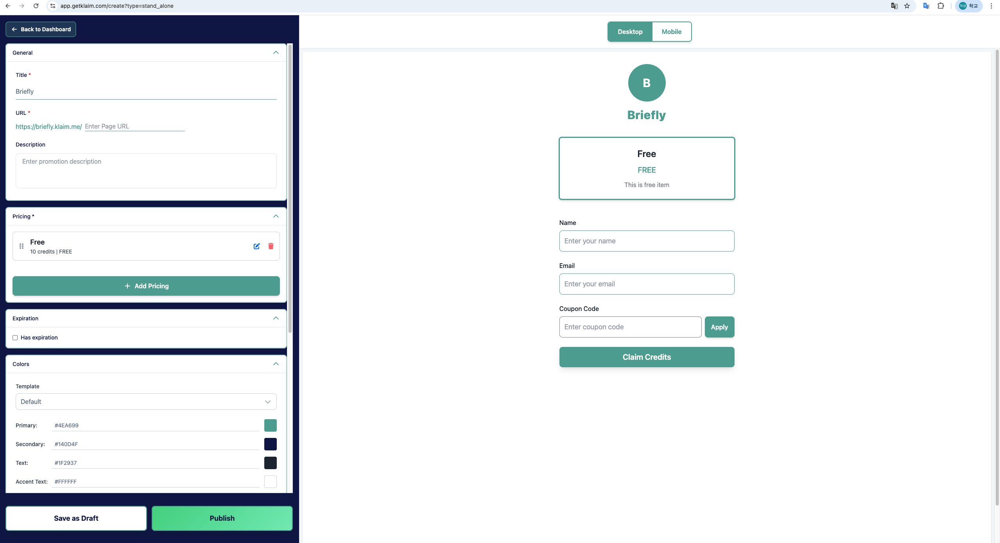
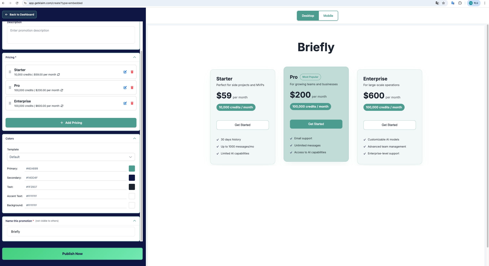

# Klaim 프로모션 페이지 현황 분석

## 개요

Klaim 플랫폼은 두 가지 방식의 프로모션 페이지를 제공합니다:
1. **Stand-alone Page**: 독립적인 URL을 가진 전용 페이지
2. **Embedded Widget**: 다른 웹사이트에 임베드 가능한 위젯

## 1. Stand-alone Page (독립 페이지 방식)

### 1.1 상단 네비게이션
- **Back to Dashboard**: 대시보드로 돌아가기 버튼
- **Desktop / Mobile 토글**: 미리보기를 데스크톱 또는 모바일 뷰로 전환

### 1.2 좌측 설정 패널

#### 1.2.1 General 섹션 (접기/펼치기 가능)
| 필드 | 설명 | 필수여부 |
|------|------|----------|
| **Title** | 프로모션 제목 (예: "Briefly") | 필수 |
| **URL** | 페이지 URL 설정 (https://briefly.klaim.me/ + 커스텀 URL) | 필수 |
| **Description** | 프로모션 설명 텍스트 | 선택 |

#### 1.2.2 Pricing 섹션 (접기/펼치기 가능)

**기존 가격 플랜 관리**
- **드래그 핸들 (⋮⋮)**: 가격 항목 순서 변경 가능
- **편집 버튼 (연필 아이콘)**: 기존 가격 수정
- **삭제 버튼 (휴지통 아이콘)**: 가격 항목 삭제
- **+ Add Pricing 버튼**: 새 가격 옵션 추가

**Add/Edit Pricing 모달 설정 항목**
| 옵션 | 설명 | 예시 |
|------|------|------|
| **Units** | 제공할 단위 수량 | 10 |
| **Unit** | 단위명 커스터마이징 | credits, tokens 등 |
| **Free/Paid 토글** | 무료 또는 유료 선택 | Free/Paid |
| **Price** | 유료 선택 시 가격 ($) | $59.00 |
| **Name** | 가격 옵션 이름 | Free, Premium 등 |
| **Description** | 가격 옵션 설명 | "This is free item" |

#### 1.2.3 Expiration 섹션 (접기/펼치기 가능)
- **Has expiration 체크박스**: 만료일 설정 활성화/비활성화
- **Expiration date/time**: 날짜 및 시간 선택기 (체크박스 활성화 시 표시)
- ✨ **자동 기능**: 만료일 설정 시 미리보기에 "Limited-time offer" 배너 자동 표시

#### 1.2.4 Colors 섹션 (접기/펼치기 가능)

**템플릿 프리셋 (7개)**
| 템플릿 | 색상 테마 | Primary | Secondary |
|--------|-----------|---------|-----------|
| Default | 기본 민트/네이비 | #4EA699 | #140D4F |
| Ocean | 파란색 계열 | - | - |
| Sunset | 주황/노란 계열 | - | - |
| Forest | 녹색 계열 | - | - |
| Black & White | 흑백 | - | - |
| Midnight | 어두운 파란색 계열 | - | - |
| Dark Ocean | 어두운 파란/청록 계열 | - | - |

**개별 색상 커스터마이징**
| 색상 | 기본값 | 용도 |
|------|--------|------|
| **Primary** | #4EA699 | 주요 버튼, 강조 색상 |
| **Secondary** | #140D4F | 보조 색상 |
| **Text** | #1F2937 | 본문 텍스트 색상 |
| **Accent Text** | #FFFFFF | 강조 텍스트 색상 |
| **Background** | #FFFFFF | 배경 색상 |

#### 1.2.5 Name this promotion 섹션 (접기/펼치기 가능)
- **내부 이름 설정**: 다른 사용자에게는 보이지 않는 캠페인 관리용 레이블
- **예시**: "Campaign from 1/4 to 1/21"

#### 1.2.6 Link Preview 섹션 (접기/펼치기 가능)
| 필드 | 설명 |
|------|------|
| **Title** | 소셜 공유 시 표시될 제목 |
| **Description** | 소셜 공유 시 표시될 설명 |
| **Generate preview image 버튼** | 소셜 공유용 최적화 이미지 자동 생성 (Title과 Description 입력 필수) |

### 1.3 우측 미리보기 패널

#### 1.3.1 실시간 미리보기
- 설정 변경사항이 실시간으로 반영되는 미리보기 화면
- 실제 사용자 경험과 동일한 프리뷰 제공

#### 1.3.2 프리뷰 구성 요소
- **로고/이니셜 아이콘**: 브랜드 식별자
- **브랜드명**: 설정된 Title 표시
- **가격 카드**: 
  - 플랜 이름 (예: "Free")
  - 가격 표시 (예: "FREE")
  - 플랜 설명 텍스트
- **입력 폼**:
  - Name 필드
  - Email 필드
  - Coupon Code 필드 + Apply 버튼
- **CTA 버튼**: "Claim Credits" 제출 버튼

### 1.4 저장 및 게시 옵션
| 버튼 | 설명 |
|------|------|
| **Save as Draft** | 초안으로 저장 (미게시 상태) |
| **Publish** | 프로모션 게시 (공개 상태로 전환) |

## 2. Embedded Widget (임베드 위젯 방식)

### 2.1 상단 네비게이션
- **Back to Dashboard**: 대시보드로 돌아가기 버튼
- **Desktop / Mobile 토글**: 미리보기를 데스크톱 또는 모바일 뷰로 전환

### 2.2 좌측 설정 패널

#### 2.2.1 General 섹션 (접기/펼치기 가능)
| 필드 | 설명 | 비고 |
|------|------|------|
| **Title** | 프로모션 제목 (예: "Briefly") | Stand-alone과 동일 |
| **Description** | 프로모션 설명 텍스트 | URL 설정 없음 |

#### 2.2.2 Pricing 섹션 (접기/펼치기 가능)

**기존 가격 플랜 관리**
- **드래그 핸들 (6점 아이콘)**: 플랜 순서 변경 가능
- **편집 버튼 (연필 아이콘)**: 플랜 수정
- **삭제 버튼 (휴지통 아이콘)**: 플랜 삭제
- **+ Add Pricing 버튼**: 새 가격 옵션 추가

**Add/Edit Pricing 모달 설정 항목**
| 옵션 | 설명 | 예시 |
|------|------|------|
| **How many units** | 제공 수량 입력 | 10000 |
| **Unit** | 단위 입력 | credits |
| **Offer Type** | Free / Paid / Contact 중 선택 | Paid |
| **Price** | 가격 입력 ($ 단위, 월 반복 결제) | $59.00 per month |
| **Name** | 플랜 이름 | Starter, Pro, Enterprise |
| **Description** | 플랜 설명 | - |
| **Bullet Points** | 기능 목록 추가/삭제 가능 | + Add Bullet Point / Remove |
| **Highlight Product** | 체크 시 임베드 뷰에서 해당 상품 강조 표시 | Most Popular 태그 |

#### 2.2.3 Colors 섹션 (접기/펼치기 가능)

**템플릿 프리셋 (7개)**
| 템플릿 | 색상 테마 |
|--------|-----------|
| Default | 기본 민트/네이비 (#4EA699/#140D4F) |
| Ocean | 파랑/하늘색 계열 |
| Sunset | 주황/빨강 계열 |
| Forest | 진초록/연초록 계열 |
| Black & White | 회색 계열 |
| Midnight | 진파랑/하늘색 계열 |
| Dark Ocean | 청록/하늘색 계열 |

**개별 색상 커스터마이징 (컬러 피커 제공)**
| 색상 | 기본값 | 용도 |
|------|--------|------|
| **Primary** | #4EA699 | 주요 버튼, 뱃지 색상 |
| **Secondary** | #140D4F | 보조 색상 |
| **Text** | #1F2937 | 본문 텍스트 색상 |
| **Accent Text** | #FFFFFF | 강조 텍스트 색상 |
| **Background** | #FFFFFF | 배경 색상 |

#### 2.2.4 Name this promotion 섹션 (접기/펼치기 가능)
- **프로모션 내부 이름 지정**: 다른 사용자에게 표시되지 않는 관리용 레이블
- **예시**: "Campaign from 1/4 to 1/21"

### 2.3 우측 미리보기 패널

#### 2.3.1 미리보기 옵션
| 버튼 | 설명 |
|------|------|
| **Desktop** | 데스크톱 화면 미리보기 (3열 가로 배치) |
| **Mobile** | 모바일 화면 미리보기 (1열 세로 스택) |

#### 2.3.2 레이아웃
- **Desktop**: 3열 그리드 형태의 가격 플랜 카드
- **Mobile**: 반응형으로 1열 세로 배치로 전환
- **실시간 동기화**: 설정 변경사항 즉시 반영

#### 2.3.3 각 플랜 카드 구성 요소
**카드 헤더**
- 플랜명 (Starter/Pro/Enterprise)
- "Most Popular" 태그 (Highlight Product 체크 시)

**카드 내용**
- 설명 텍스트
- 가격 정보 (예: $59.00 per month)
- 크레딧 수량 표시 (예: 10,000 credits)
- "Get Started" 버튼

**기능 목록 (Bullet Points)**
- **Starter**: 30 days history, Up to 1000 messages/mo, Limited AI capabilities
- **Pro**: Email support, Unlimited messages, Access to AI capabilities  
- **Enterprise**: Customizable AI models, Advanced team management, Enterprise-level support

### 2.4 게시 옵션
| 버튼 | 설명 |
|------|------|
| **Publish Now** | 프로모션 즉시 게시 (단일 버튼) |

## 3. 공통점과 차이점

### 3.1 공통점
- **레이아웃 구조**: 좌측 설정 패널 / 우측 프리뷰 패널
- **공통 섹션**: General, Pricing, Colors, Name this promotion
- **실시간 미리보기**: 설정 변경사항 즉시 반영
- **반응형 뷰**: Desktop/Mobile 전환 가능
- **색상 시스템**: 7가지 템플릿 프리셋 + 5가지 개별 색상 커스터마이징
- **상단 네비게이션**: Back to Dashboard, Desktop/Mobile 토글
- **드래그 앤 드롭**: 가격 플랜 순서 변경 가능
- **접기/펼치기**: 모든 설정 섹션에서 지원

### 3.2 주요 차이점

| 구분 | Stand-alone Page | Embedded Widget |
|------|------------------|-----------------|
| **배포 방식** | 독립적인 URL 페이지 | 다른 웹사이트에 임베드 |
| **URL 설정** | ✅ 커스텀 URL 입력 필드 | ❌ URL 설정 없음 |
| **Expiration 섹션** | ✅ 만료일 설정 가능 | ❌ 만료일 설정 없음 |
| **Link Preview 섹션** | ✅ 소셜 공유 최적화 | ❌ Link Preview 없음 |
| **저장 옵션** | Save as Draft + Publish | Publish Now (단일 버튼) |
| **미리보기 레이아웃** | 단일 폼 + 가격 카드 | 다중 가격 카드 그리드 |

### 3.3 Pricing 모달 차이점

| 설정 항목 | Stand-alone Page | Embedded Widget |
|----------|------------------|-----------------|
| **수량 필드명** | Units | How many units |
| **제공 타입** | Free/Paid 토글 | Free/Paid/Contact 선택 |
| **기능 목록** | ❌ Bullet Points 없음 | ✅ Bullet Points 추가/삭제 |
| **강조 표시** | ❌ Highlight 기능 없음 | ✅ Highlight Product 체크박스 |

### 3.4 사용 시나리오

#### Stand-alone Page
- **목적**: 독립적인 프로모션 랜딩 페이지
- **특징**: 소셜 공유 최적화, 임시 저장 기능
- **적합한 경우**: 
  - 마케팅 캠페인용 전용 페이지
  - 소셜 미디어 공유가 중요한 프로모션
  - 만료일이 있는 한정 오퍼

#### Embedded Widget
- **목적**: 기존 웹사이트에 통합 가능한 위젯
- **특징**: 다중 플랜 비교, 즉시 게시
- **적합한 경우**:
  - 회사 웹사이트의 가격 페이지
  - 제품별 상세한 기능 비교가 필요한 경우
  - 여러 플랜을 한 번에 보여줘야 하는 상황

## 4. UI/UX 특징

### 4.1 설정 패널 특징
- **접기/펼치기**: 모든 섹션에서 지원 (▼ 아이콘 클릭)
- **드래그 앤 드롭**: 가격 플랜 순서 변경 (⋮⋮ 또는 6점 아이콘)
- **인라인 편집**: 연필 아이콘으로 기존 항목 수정
- **삭제 기능**: 휴지통 아이콘으로 항목 제거
- **실시간 검증**: 입력값 검증 및 즉시 피드백 제공
- **직관적 폼**: 필수/선택 필드 명확히 구분

### 4.2 프리뷰 패널 특징
- **실시간 동기화**: 좌측 설정 변경사항이 즉시 우측에 반영
- **반응형 뷰 전환**: Desktop/Mobile 토글로 다양한 화면 크기 확인
- **실제 경험**: 최종 사용자가 보게 될 화면과 동일한 미리보기
- **상호작용**: 실제 버튼과 폼 요소가 동작하는 라이브 프리뷰

### 4.3 색상 시스템
- **7가지 템플릿 프리셋**: Default, Ocean, Sunset, Forest, Black & White, Midnight, Dark Ocean
- **5가지 개별 색상**: Primary, Secondary, Text, Accent Text, Background
- **컬러 피커**: HEX 코드 직접 입력 또는 시각적 색상 선택
- **실시간 적용**: 색상 변경이 미리보기에 즉시 반영

### 4.4 모달 인터페이스
- **Add/Edit Pricing**: 가격 플랜 추가/수정을 위한 전용 모달
- **단계별 입력**: 논리적 순서로 배치된 입력 필드
- **조건부 필드**: 선택에 따라 표시되는 관련 옵션들
- **검증 메시지**: 입력 오류 시 즉시 안내 메시지 표시

### 4.5 네비게이션 특징
- **브레드크럼**: Back to Dashboard로 명확한 경로 제공
- **상태 저장**: 페이지 이동 시에도 작업 내용 유지
- **키보드 내비게이션**: 탭 키를 통한 접근성 지원

## 5. 개선 기회

### 5.1 현재 폼 기반 인터페이스의 한계

#### 사용성 측면
- **많은 필드**: 다양한 설정 옵션으로 인한 인터페이스 복잡성
- **섹션 간 이동**: 설정을 위해 여러 섹션을 오가는 번거로움
- **학습 곡선**: 모든 옵션을 이해하고 활용하기까지 시간 소요
- **모달 피로**: 가격 플랜 추가/수정 시 반복적인 모달 조작

#### 효율성 측면
- **순차적 설정**: 논리적이지 않은 설정 순서
- **반복 작업**: 유사한 가격 플랜 생성 시 동일한 과정 반복
- **검증 지연**: 설정 완료 후에야 문제 발견 가능

### 5.2 AI 대화 기반 인터페이스 도입 시 기대효과

#### 직접적 개선
- **자연어 입력**: "3개 플랜으로 스타터 $59, 프로 $200, 엔터프라이즈 $600" 같은 자연어로 빠른 설정
- **상황 인식**: 사용자 의도를 파악하여 관련 설정을 함께 제안
- **실시간 가이드**: 설정 과정에서 실시간 도움말과 제안 제공
- **오류 방지**: 설정 중 문제점을 사전에 감지하고 대안 제시

#### 사용자 경험 개선
- **진입 장벽 완화**: 복잡한 UI 학습 없이 직관적 대화로 설정 완료
- **개인화**: 사용자의 이전 설정 패턴을 학습하여 맞춤형 제안
- **효율성 증대**: 반복 작업 최소화와 자동화된 설정 생성
- **접근성 향상**: 시각적 인터페이스에 의존하지 않는 음성/텍스트 기반 조작

### 5.3 구현 방향
- **하이브리드 접근**: 기존 UI와 AI 대화를 병행하여 사용자 선택권 보장
- **점진적 도입**: 특정 기능(가격 설정, 색상 선택 등)부터 AI 지원 시작
- **학습 기능**: 사용자 행동 패턴을 분석하여 지속적인 UX 개선